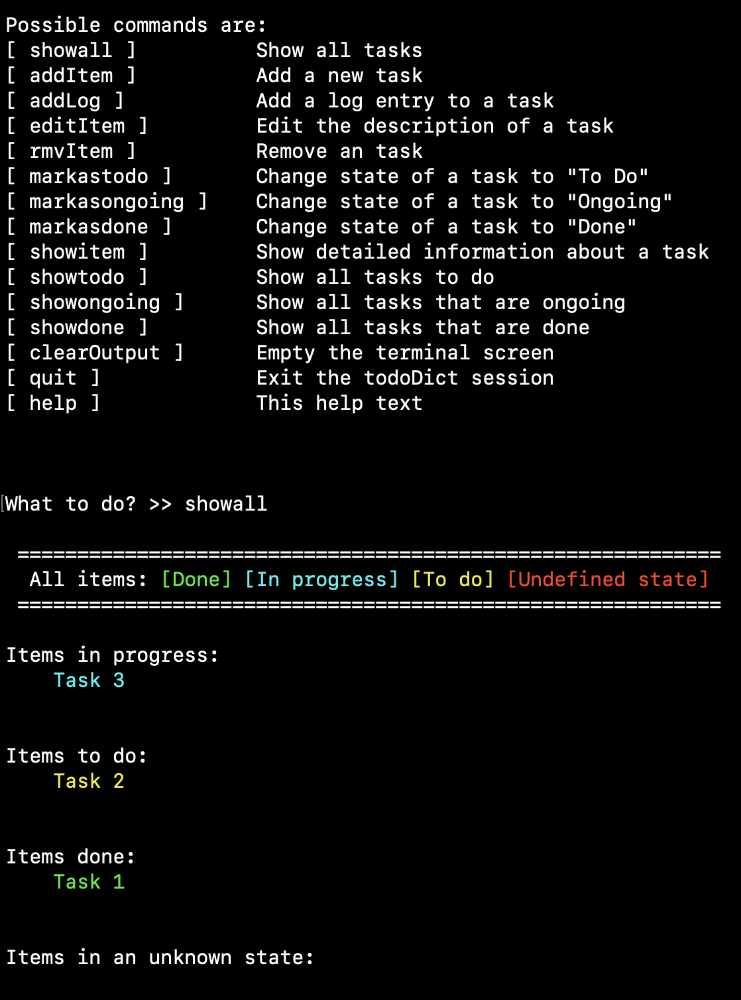

# Simple Project Management TUI
A simple TUI (text-based user interface) for logging and keeping track of things and projects to do, in progress, and completed.

# Package history
Original author is Benjamin Bolling, (ORCID iD 0000-0002-6650-5365)[https://orcid.org/0000-0002-6650-5365].

Package development began 2021-01-28, version 1 finished 2021-01-30.

# Setup
Requires python 3.6 or higher.

Execute `pip install -r requirements.txt` to install python packages required.

# Launch SPM TUI
Execute `python runSPM.py` to start running the package.

# How-to-use
The TUI has tab-completion implemented to aid the user. At start-up, the user is prompted to either create a new file [ `new` ] or to load a previously created file [ `load` ]. The file extension is `.tdDict`, which stands for *to-do dictionary*. In the rest of the TUI session, the user can use the list of commands defined in Table 1.

Table 1: Implemented commands and their meaning.
| Command | Meaning |
| :----------: | :----------: |
| `showall` | Show all tasks |
| `addItem` | Add a new task |
| `addLog` | Add a log entry to a task |
| `editItem` | Edit the description of a task |
| `rmvItem` | Remove an task |
| `markastodo` | Change state of a task to "To Do" |
| `markasongoing` | Change state of a task to "Ongoing" |
| `markasdone` | Change state of a task to "Done" |
| `showitem` | Show detailed information about a task |
| `showtodo` | Show all tasks to do |
| `showongoing` | Show all tasks that are ongoing |
| `showdone` | Show all tasks that are done |
| `clearOutput` | Empty the terminal screen |
| `exit` | Exit the todoDict session |
| `help` | A help text |

Different states of the tasks are displayed in different colours as defined in Table 2.

Table 2: Task colours and their associated states.
| Colour | State |
| :----------: | :----------: |
| Yellow | To Do |
| Cyan | In progress |
| Green | Done |
| Unknown | Red |

Each task becomes key with its own associated dictionary as a value. Each task's dictionary consists of a state (a string), a description (a string), and a log (a dictionary). The log consists of timestamps as keys (date and time) and a log entry (string) as value. When the object is created or edited (incl. changing state), a log entry is created. A user can also add log entries manually, but log entries cannot be removed. Any time a change is made, the `.tdDict` file is updated.

# Figures

Figure 1: The SPMTUI initiated and `showall` command executed.
